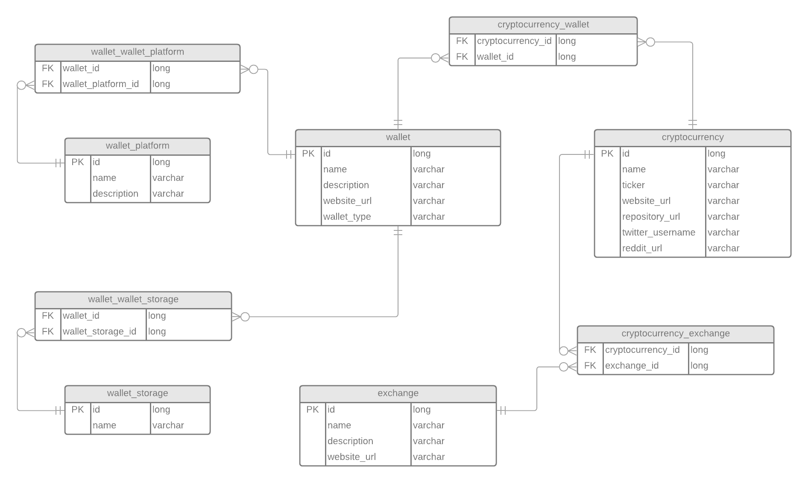

# Qryptic API 
 


## About
Qryptic is an open API to retrieve data about crypto currencies, crypto wallets and crypto exchanges. 

## Technologies

The API is built using:

- OpenJDK 16
- Spring Boot 2.5.2
- PostgreSQL

## Database Schema

The Database Schema below is the implementation of the API. It might not be totally accurate of how 
the implementation actually is, but will however be for the first initial release.



## How to use

### 1. Request a list of Exchanges:

`curl -X 'GET' 'http://api.qryptic.org/v1/exchanges?page=0&size=25' -H 'accept: */*'`

Response:

```JSON
{
  "exchanges": [
    {
      "id": 1,
      "name": "Binance",
      "description": "Binance is a cryptocurrency exchange that provides a platform for trading various cryptocurrencies.",
      "cryptocurrencies": [
        "/api/v1/cryptocurrencies/8"
      ],
      "website_url": "https://www.binance.com"
    },
    {
      "id": 2,
      "name": "Kraken",
      "description": "Kraken is a United States-based cryptocurrency exchange and bank, founded in 2011.",
      "cryptocurrencies": [
        "/api/v1/cryptocurrencies/8"
      ],
      "website_url": "https://www.kraken.com"
    }
  ],
  "total_pages": 1,
  "total_items": 2,
  "current_page": 0
}
```

### 2. Request a specific Exchange by ID:

`curl -X 'GET' 'http://api.qryptic.org/v1/exchanges/2' -H 'accept: */*'`

Response:

```JSON
{
  "id": 2,
  "name": "Kraken",
  "description": "Kraken is a United States-based cryptocurrency exchange and bank, founded in 2011.",
  "cryptocurrencies": [
    "/api/v1/cryptocurrencies/8"
  ],
  "website_url": "https://www.kraken.com"
}
```

### 3. Request a list of Crypto Currencies:

`curl -X 'GET' 'http://api.qryptic.org/v1/cryptocurrencies?page=0&size=25' -H 'accept: */*'`

Response:

```JSON
{
  "total_pages": 1,
  "cryptocurrencies": [
    {
      "id": 8,
      "name": "Bitcoin",
      "ticker": "BTC",
      "wallets": [
        "/api/v1/wallets/7"
      ],
      "exchanges": [
        "/api/v1/exchanges/1",
        "/api/v1/exchanges/2"
      ],
      "website_url": "https://bitcoin.org",
      "repository_url": "https://github.com/bitcoin/bitcoin",
      "twitter_username": "bitcoin",
      "reddit_url": "https://www.reddit.com/r/Bitcoin/"
    }
  ],
  "total_items": 1,
  "current_page": 0
}
```

### 4. Request a specific Crypto Currency by ID:

`curl -X 'GET' 'http://api.qryptic.org/v1/cryptocurrencies/8' -H 'accept: */*'`

Response:

```JSON
{
  "id": 8,
  "name": "Bitcoin",
  "ticker": "BTC",
  "wallets": [
    "/api/v1/wallets/7"
  ],
  "exchanges": [
    "/api/v1/exchanges/1",
    "/api/v1/exchanges/2"
  ],
  "website_url": "https://bitcoin.org",
  "repository_url": "https://github.com/bitcoin/bitcoin",
  "twitter_username": "bitcoin",
  "reddit_url": "https://www.reddit.com/r/Bitcoin/"
}
```

### 5. Request a list of Wallets:

`curl -X 'GET' 'http://api.qryptic.org/v1/wallets?page=0&size=25' -H 'accept: */*'`

Response:

```JSON
{
  "wallets": [
    {
      "id": 7,
      "name": "Trust Wallet",
      "description": "Buy, store, collect NFTs, exchange & earn crypto. Join 10 million+ people using Trust Wallet.",
      "cryptocurrencies": [
        "/api/v1/cryptocurrencies/8"
      ],
      "website_url": "https://trustwallet.com/",
      "wallet_type": "Software",
      "wallet_platforms": [
        "/api/v1/wallet-platforms/5",
        "/api/v1/wallet-platforms/6"
      ],
      "wallet_storages": [
        "/api/v1/wallet-storages/3",
        "/api/v1/wallet-storages/4"
      ]
    }
  ],
  "total_pages": 1,
  "total_items": 1,
  "current_page": 0
}
```

### 6. Request a specific Wallet by ID:

`curl -X 'GET' 'http://api.qryptic.org/v1/wallets/7' -H 'accept: */*'`

Response:

```JSON
{
  "id": 7,
  "name": "Trust Wallet",
  "description": "Buy, store, collect NFTs, exchange & earn crypto. Join 10 million+ people using Trust Wallet.",
  "cryptocurrencies": [
    "/api/v1/cryptocurrencies/8"
  ],
  "website_url": "https://trustwallet.com/",
  "wallet_type": "Software",
  "wallet_platforms": [
    "/api/v1/wallet-platforms/5",
    "/api/v1/wallet-platforms/6"
  ],
  "wallet_storages": [
    "/api/v1/wallet-storages/3",
    "/api/v1/wallet-storages/4"
  ]
}
```

### 7. Request a list of Wallet Platforms:

`curl -X 'GET' 'http://api.qryptic.org/v1/wallet-platforms' -H 'accept: */*'`

Response:

```JSON
[
  {
    "id": 5,
    "name": "Android",
    "description": "Android is a mobile operating system based on a modified version of the Linux kernel and other open source software, designed primarily for touchscreen mobile devices such as smartphones and tablets.",
    "wallets": [
      "/api/v1/wallets/7"
    ]
  },
  {
    "id": 6,
    "name": "iOS",
    "description": "iOS is a mobile operating system created and developed by Apple Inc. exclusively for its hardware.",
    "wallets": [
      "/api/v1/wallets/7"
    ]
  }
]
```

### 8. Request a specific Wallet Platform by ID:

`curl -X 'GET' 'http://api.qryptic.org/v1/wallet-platforms/6' -H 'accept: */*'`

Response:

```JSON
{
  "id": 6,
  "name": "iOS",
  "description": "iOS is a mobile operating system created and developed by Apple Inc. exclusively for its hardware.",
  "wallets": [
    "/api/v1/wallets/7"
  ]
}
```

### 9. Request a list of Wallet Storages:

`curl -X 'GET' 'http://api.qryptic.org/v1/wallet-storages' -H 'accept: */*'`

Response:

```JSON
[
  {
    "id": 3,
    "name": "Hot",
    "wallets": [
      "/api/v1/wallets/7"
    ]
  },
  {
    "id": 4,
    "name": "Cold",
    "wallets": [
      "/api/v1/wallets/7"
    ]
  }
]
```

### 10. Request a specific Wallet Storage by ID:

`curl -X 'GET' 'http://api.qryptic.org/v1/wallet-storages/3' -H 'accept: */*'`

Response:

```JSON
{
  "id": 3,
  "name": "Hot",
  "wallets": [
    "/api/v1/wallets/7"
  ]
}
```

## Contribute

If you would like to contribute to this project there is two ways:

- Send a pull request
- Donate to our BTC/ETH address to keep the servers running

### Pull request

We appreciate all contributions whether it be small changes such as documentation of source code to major improvement of code. The easiest way is to make a fork and then make a pull request into our develop branch. To make the PR go through make sure to include this information:

```
What does this PR do?

Why are these changes required?

This PR has been tested using (e.g. Unit Tests, Manual Testing):

Extra details?
```

### Donate

BTC: bc1ql97dlhhexma7agkk7gmg76t7ljycuqc9xgr4vl

ETH: 0x03A049028B673Cc5EF676695f442eC5614877335

## License

The license is MIT.
